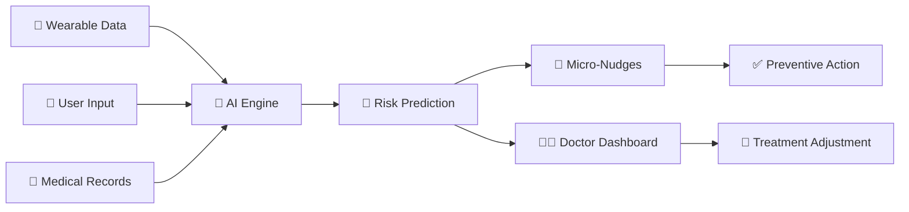

<div align="center">

# 🏥 Predictive Health Twin

### *Transforming Healthcare from Reactive to Proactive*

---

### 🎓 Team DATA SURGE | VIT Bhopal
*VITB-JHU Health Hack Submission*

</div>

---

## 📋 Table of Contents

- [🌟 Overview](#-overview)
- [❓ The Problem](#-the-problem)
- [💡 Our Solution](#-our-solution)
- [✨ Key Features](#-key-features)
- [🎬 Demo](#-demo)
- [🛠️ Technology Stack](#️-technology-stack)
- [💻 Installation](#-installation)
- [📊 How It Works](#-how-it-works)
- [🎯 Use Cases](#-use-cases)
- [📈 Impact](#-impact)
- [🗺️ Roadmap](#️-roadmap)


---

## 🌟 Overview

<div align="center">

```
┌─────────────────────────────────────────────────────────────┐
│                                                             │
│   📱 Wearables  →  🧠 AI Analysis  →  ⚡ Predictions       │
│                                                             │
│   Real-time data → Pattern detection → Proactive nudges    │
│                                                             │
└─────────────────────────────────────────────────────────────┘
```

</div>

The **Predictive Health Twin** is an AI-powered digital companion that learns your unique health patterns and predicts chronic disease flare-ups **before they happen**. Think of it as your personal health guardian that watches over you 24/7, alerting you to potential problems days in advance.

> **🎯 Mission**: Stop health crises before they start by transforming passive monitoring into active prevention.

---

## ❓ The Problem

### Current Healthcare Challenges

<table>
<tr>
<td width="50%">

#### ⏰ Reactive, Not Proactive
- Patients seek help **after** symptoms worsen
- Emergency visits when damage is already done
- Treatment instead of prevention

</td>
<td width="50%">

#### 📊 Data Overload
- Wearables generate tons of data
- No tools to translate data → actions
- Patients drowning in metrics

</td>
</tr>
<tr>
<td width="50%">

#### 👥 One-Size-Fits-All
- Generic advice: "eat healthy, exercise"
- Ignores individual biological responses
- Not personalized to YOU

</td>
<td width="50%">

#### 🔌 Disconnected Care
- Dangerous gaps between doctor visits
- No real-time physician insights
- Patient-doctor communication breakdown

</td>
</tr>
</table>

### 💰 The Cost

- **41 million** deaths per year from chronic diseases
- **80%** are preventable
- **$2,000+** average ER visit cost
- Countless hours of suffering and anxiety

---

## 💡 Our Solution

<div align="center">

### The Predictive Health Twin: Your AI Health Guardian



</div>

### Three Pillars of Innovation

<table>
<tr>
<td align="center" width="33%">

### 1️⃣ Data Fusion
**Multi-Modal Intelligence**

📊 Heart rate variability<br>
😴 Sleep patterns<br>
🧘 Stress levels<br>
🚶 Activity data<br>
🩸 Vital signs<br>
📝 Diet & mood logs

</td>
<td align="center" width="33%">

### 2️⃣ AI Analysis
**Predictive Power**

🔮 Pattern detection<br>
⏰ 6-48 hour forecasts<br>
🎯 Individual baselines<br>
📈 Trend analysis<br>
🧠 Continuous learning<br>
⚡ Real-time processing

</td>
<td align="center" width="33%">

### 3️⃣ Action
**Micro-Nudges**

💬 Simple messages<br>
🎯 Context-aware<br>
⏱️ Timely interventions<br>
👨‍⚕️ Doctor insights<br>
📊 Clinical dashboard<br>
🔄 Feedback loops

</td>
</tr>
</table>

---

## ✨ Key Features

### 🔮 Predictive, Not Reactive

<table>
<tr>
<td width="50%">

#### ❌ Traditional Apps
- "Your heart rate **was** 85 bpm yesterday"
- Shows past data
- Reactive alerts
- After-the-fact notifications

</td>
<td width="50%">

#### ✅ Predictive Health Twin
- "High risk of BP spike **in 6 hours**"
- Forecasts future risks
- Proactive interventions
- Prevention before problems

</td>
</tr>
</table>

### 🎯 N-of-1 Personalization

```
Population Average Approach:
┌────────────────────────────────┐
│ Everyone: HR should be 60-100  │  ❌ Not personalized
│ Sleep: Aim for 8 hours         │  ❌ Generic advice
└────────────────────────────────┘

Our N-of-1 Approach:
┌────────────────────────────────┐
│ YOUR baseline HR: 68 ± 7 bpm  │  ✅ Learns YOUR normal
│ YOUR optimal sleep: 7.2 hours  │  ✅ Adapts to YOU
│ Alert: You're 2σ above normal  │  ✅ Personalized insights
└────────────────────────────────┘
```

### 🔗 Closes the Patient-Doctor Loop

<div align="center">

**Before**: Patient ← ─ ─ ─ (3 months gap) ─ ─ ─ → Doctor

**With Our System**: Patient ←→ AI Twin ←→ Doctor Dashboard ←→ Data-Driven Care

</div>

### 🛡️ Privacy by Design

| Feature | Description |
|---------|-------------|
| 🔒 **Edge AI** | Raw data stays on YOUR device |
| 🔐 **Encryption** | End-to-end encrypted cloud sync |
| 👻 **Anonymization** | No personally identifiable info in analytics |
| ✅ **GDPR Ready** | Full compliance with privacy laws |
| 🏥 **HIPAA Compatible** | Healthcare data standards |

---

## 🎬 Demo

<div align="center">


</div>

### 📸 Screenshots

<table>
<tr>
<td align="center" width="50%">

#### 📊 Real-Time Dashboard
*Monitor vitals compared to YOUR baseline*

```
┌─────────────────────────────┐
│ 💓 Heart Rate: 78 bpm (+6) │
│ 😴 Sleep: 6.2 hrs (-1.3)   │
│ 😰 Stress: 7/10 (+3)       │
│ 🩸 Glucose: 145 mg/dL (+35)│
└─────────────────────────────┘
```

</td>
<td align="center" width="50%">

#### 🔮 Prediction Engine
*AI-powered risk forecasting*

```
┌─────────────────────────────┐
│ ⚠️ ELEVATED RISK (68%)     │
│                             │
│ 📱 Micro-Nudges:            │
│ • Take 10-min walk NOW      │
│ • Check glucose in 2 hours  │
│ • Avoid caffeine today      │
└─────────────────────────────┘
```

</td>
</tr>
<tr>
<td align="center" width="50%">

#### 📈 Historical Analysis
*30-day trends and patterns*

```
Risk Timeline:
█████░░░░█████████░░░░░░░░░░
Day 1 ────────────────→ Day 30
      Normal    Risk Period
```

</td>
<td align="center" width="50%">

#### 👨‍⚕️ Clinical Dashboard
*Doctor's view of patient data*

```
┌─────────────────────────────┐
│ Patient: John Doe           │
│ Risk Days: 3/30             │
│ Compliance: 94%             │
│                             │
│ 📋 Recommendation:          │
│ • Review medication dosage  │
│ • Follow-up in 2 weeks      │
└─────────────────────────────┘
```

</td>
</tr>
</table>

---

## 🛠️ Technology Stack

<div align="center">

### Built With Modern, Production-Ready Technologies

</div>

<table>
<tr>
<td align="center" width="25%">

### 🎨 Frontend


Clean, interactive web interface

</td>
<td align="center" width="25%">

### ⚙️ Backend


Flask/FastAPI for APIs

</td>
<td align="center" width="25%">

### 🧠 AI/ML


Predictive models

</td>
<td align="center" width="25%">

### 💾 Database


Real-time & structured data

</td>
</tr>
</table>

### 📦 Complete Stack

```yaml
Frontend:
  - Streamlit: Web framework
  - Plotly: Interactive charts
  - HTML/CSS: Custom styling

Backend:
  - Python 3.8+: Core language
  - Flask/FastAPI: API framework
  - Pandas/NumPy: Data processing

AI/ML:
  - Scikit-learn: ML models
  - TensorFlow Lite: Edge AI
  - Random Forest: Classification

Data:
  - Firebase: Real-time sync
  - PostgreSQL: Medical records
  - Pandas: Analysis

Hardware:
  - BLE Wearables: Fitbit, Apple Watch
  - Smartphone sensors: Built-in
```

---

## 💻 Installation

### 🚀 Quick Start (5 minutes)

#### Prerequisites

```bash
✓ Python 3.8 or higher
✓ pip package manager
✓ 100MB free disk space
```

#### Step 1: Clone Repository

```bash
git clone https://github.com/YOUR-USERNAME/predictive-health-twin.git
cd predictive-health-twin
```

#### Step 2: Create Virtual Environment

**Windows:**
```bash
python -m venv venv
venv\Scripts\activate
```

**Mac/Linux:**
```bash
python3 -m venv venv
source venv/bin/activate
```

#### Step 3: Install Dependencies

```bash
pip install -r requirements.txt
```

#### Step 4: Run Application

```bash
streamlit run app.py
```

#### Step 5: Open Browser

```
🌐 Navigate to: http://localhost:8501
```

### 🎉 Success!

You should see the Predictive Health Twin interface. Click "Generate New Patient Data" to start exploring!

---

## 📊 How It Works

<div align="center">

### The Three-Phase Learning Process

</div>

```
┌─────────────────┐    ┌─────────────────┐    ┌─────────────────┐
│  Phase 1        │    │  Phase 2        │    │  Phase 3        │
│  LEARNING       │───▶│  VALIDATION     │───▶│  PREDICTION     │
│  (Weeks 1-2)    │    │  (Weeks 3-4)    │    │  (Ongoing)      │
└─────────────────┘    └─────────────────┘    └─────────────────┘
│                      │                      │
│ • Observe silently   │ • Test predictions   │ • Real-time alerts
│ • Build baseline     │ • User feedback      │ • Proactive nudges
│ • No alerts yet      │ • Model refinement   │ • Continuous learning
│ • Data collection    │ • Accuracy tuning    │ • Doctor dashboard
```

### 🔬 The Algorithm

1. **Data Collection** (Every 5 minutes)
   ```
   Wearable → Phone → Secure Storage
   ```

2. **Pattern Recognition** (Continuous)
   ```
   ML Model analyzes:
   - Heart rate trends
   - Sleep quality changes
   - Stress level correlations
   - Activity pattern shifts
   ```

3. **Risk Calculation** (Real-time)
   ```
   Risk Score = f(current_data, baseline, historical_patterns)
   
   If Risk > 60%  → HIGH RISK alert
   If Risk > 30%  → MEDIUM RISK warning
   If Risk < 30%  → LOW RISK (all good!)
   ```

4. **Intervention** (Immediate)
   ```
   Generate personalized micro-nudge based on:
   - Specific risk factors
   - Time of day
   - User location
   - Available actions
   ```

---

## 🎯 Use Cases

### 💉 For Diabetic Patients

<table>
<tr>
<td width="50%">

**What We Predict:**
- Blood glucose instability
- Hypoglycemic events
- Hyperglycemic crises
- Insulin resistance patterns

</td>
<td width="50%">

**Sample Nudges:**
- "Risk of glucose spike in 4 hours. Skip dessert at lunch."
- "Low sleep detected. Check glucose every 3 hours today."
- "Stress elevated. Risk of insulin resistance. Take a break."

</td>
</tr>
</table>

### ❤️ For Hypertensive Patients

<table>
<tr>
<td width="50%">

**What We Predict:**
- Blood pressure spikes
- Hypertensive crises
- Stress-related elevation
- Medication effectiveness

</td>
<td width="50%">

**Sample Nudges:**
- "High BP risk this afternoon. Take 15-min walk now."
- "Sleep deprivation detected. Limit sodium today."
- "Stress critical. Practice breathing exercises."

</td>
</tr>
</table>

### 👨‍⚕️ For Healthcare Providers

<table>
<tr>
<td width="50%">

**What They See:**
- 30-day risk timeline
- Patient compliance metrics
- Trend analysis
- Critical event predictions

</td>
<td width="50%">

**Benefits:**
- Data-driven treatment adjustments
- Remote patient monitoring
- Reduced office visits
- Proactive intervention opportunities

</td>
</tr>
</table>

---

## 📈 Impact

<div align="center">

### 🌍 Making Healthcare Accessible, Affordable, and Proactive

</div>

### 💚 Social Impact

<table>
<tr>
<td align="center" width="33%">

#### 👤 Patient Empowerment
**From Helpless to In Control**

✓ Real-time insights<br>
✓ Reduced anxiety<br>
✓ Agency over health<br>
✓ Better quality of life

</td>
<td align="center" width="33%">

#### 🌐 Healthcare Democratization
**Elite Care for Everyone**

✓ Smartphone-accessible<br>
✓ No special equipment<br>
✓ Affordable ($10/month)<br>
✓ Reduces disparities

</td>
<td align="center" width="33%">

#### 🏥 System Efficiency
**Better Resource Allocation**

✓ Fewer ER visits<br>
✓ Remote monitoring<br>
✓ Optimized doctor time<br>
✓ Focus on acute cases

</td>
</tr>
</table>

### 💰 Economic Impact

```
Traditional Approach:
┌─────────────────────────────────────────┐
│ Monthly cost: $300-500                  │
│ - Doctor visits: $200                   │
│ - Tests: $100-200                       │
│ - Emergency visits: $2,000+ (occasional)│
└─────────────────────────────────────────┘

With Predictive Health Twin:
┌─────────────────────────────────────────┐
│ Monthly cost: $10                       │
│ - App subscription: $10                 │
│ - Fewer doctor visits (50% reduction)   │
│ - Prevented ER visits: Priceless        │
│                                         │
│ 💰 Savings: $3,000-5,000 per year      │
└─────────────────────────────────────────┘
```

### ❤️ Health Outcomes

<table>
<tr>
<td width="50%">

#### ⏰ Time Savings
- **6-48 hours** advance warning
- **50% reduction** in ER visits
- **30% fewer** doctor appointments
- More time for **living life**

</td>
<td width="50%">

#### 📊 Better Outcomes
- **Earlier intervention** = less damage
- **Continuous monitoring** = safer
- **Data-driven care** = more effective
- **Patient engagement** = better adherence

</td>
</tr>
</table>

---

## 🗺️ Roadmap

<div align="center">

### Our Journey from MVP to Global Health Platform

</div>

### ✅ Phase 1: MVP (Current - Q1 2025)

- [x] Core AI prediction engine
- [x] Web-based demo application
- [x] Diabetic patient profile
- [x] Hypertensive patient profile
- [x] Clinical dashboard prototype
- [x] Basic micro-nudge system

### 📱 Phase 2: Mobile App (Q2 2025)

- [ ] Native iOS application
- [ ] Native Android application
- [ ] Apple Health integration
- [ ] Google Fit integration
- [ ] Fitbit API connection
- [ ] Push notification system
- [ ] Offline mode support
- [ ] Voice commands (Alexa, Siri)

### 🔬 Phase 3: Clinical Validation (Q3 2025)

- [ ] Partner with 3-5 hospitals
- [ ] Clinical trial: 100+ patients
- [ ] 6-month longitudinal study
- [ ] Peer-reviewed research paper
- [ ] FDA wellness tool submission
- [ ] HIPAA certification
- [ ] Insurance partnerships

### 🚀 Phase 4: Scale (Q4 2025 - 2026)

- [ ] Support 10+ chronic conditions
  - Heart disease
  - Asthma/COPD
  - Arthritis
  - Kidney disease
  - Mental health conditions
- [ ] Multi-language support (10+ languages)
- [ ] Enterprise healthcare integration
- [ ] AI model improvements (95%+ accuracy)
- [ ] Predictive pharmacy refills
- [ ] Telemedicine integration
- [ ] Global expansion

### 🌟 Phase 5: Advanced Features (2026+)

- [ ] AI-powered medication adjustment recommendations
- [ ] Social determinants of health integration
- [ ] Community health challenges
- [ ] Family health tracking
- [ ] Genetic risk factor integration
- [ ] Mental health prediction module
- [ ] Nutrition AI coach

